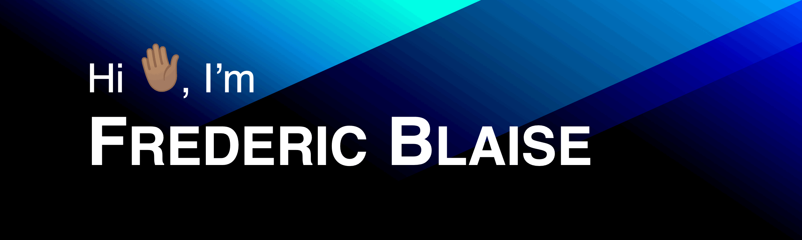
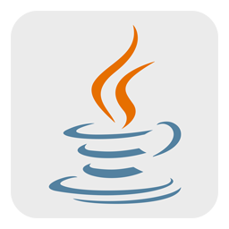

## ⭐️ About Me
My name is Fred and I am an aspiring full-stack developer. On this profile, you'll find various projects that I've worked on.

I have a passion for web development and enjoy building responsive web applications with React, Tailwind, Python, and Django.

My goal is to continue learning new technologies and keep building amazing experiences. Feel free to check out my work and contact me if you have any questions or comments! 

## 🛠️ Tech & Tools I've Used

  
  
  
  
  
  
  
  
  
  
  
  
  

